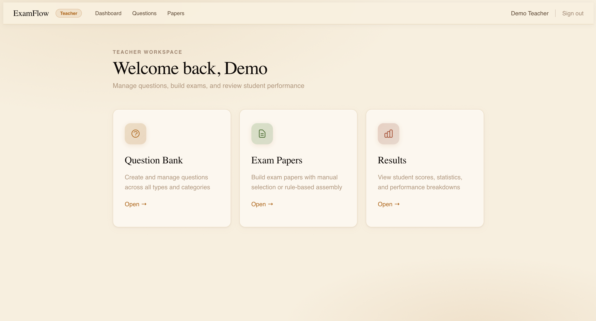
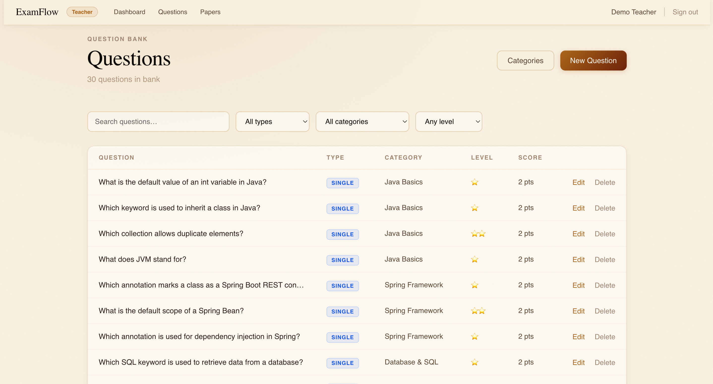
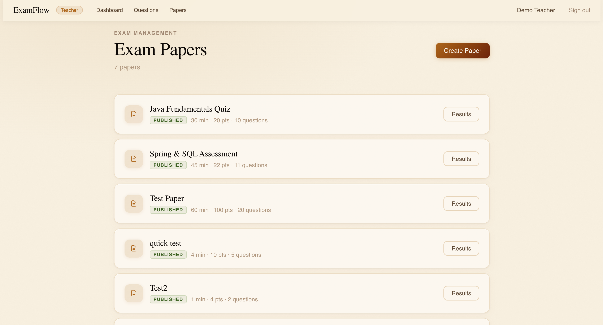
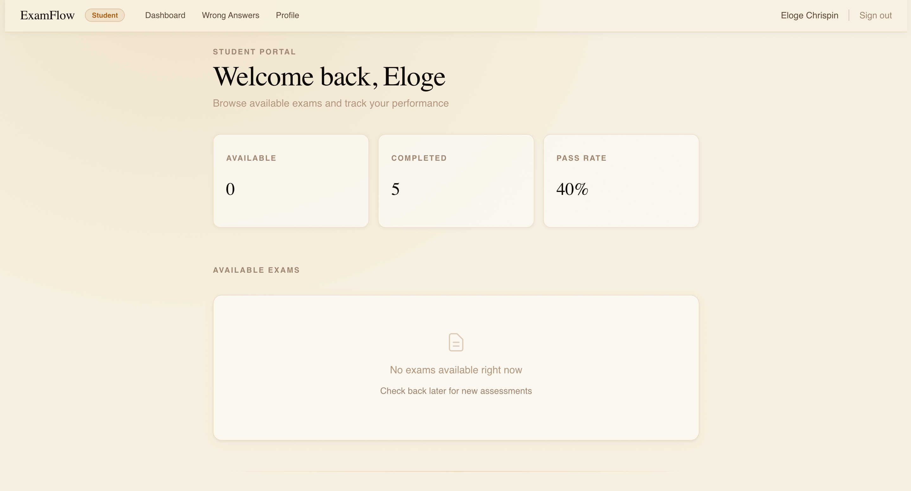
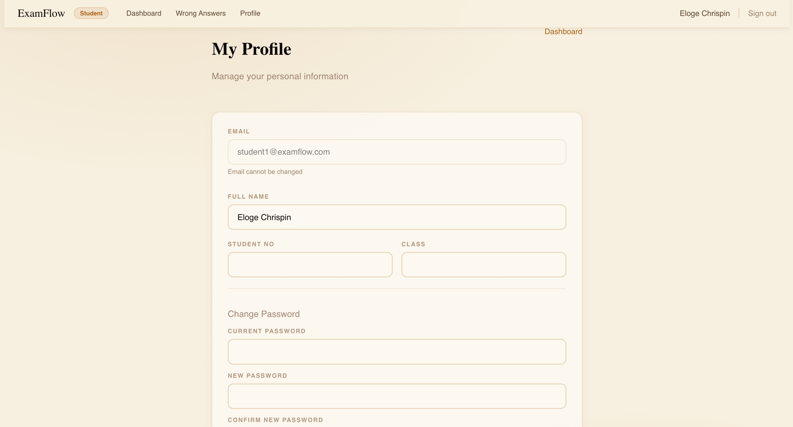
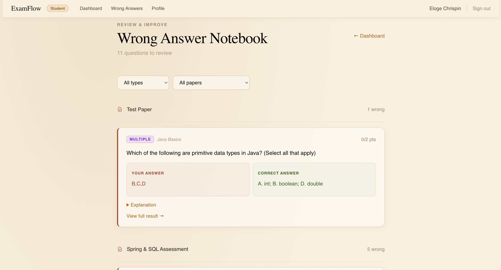
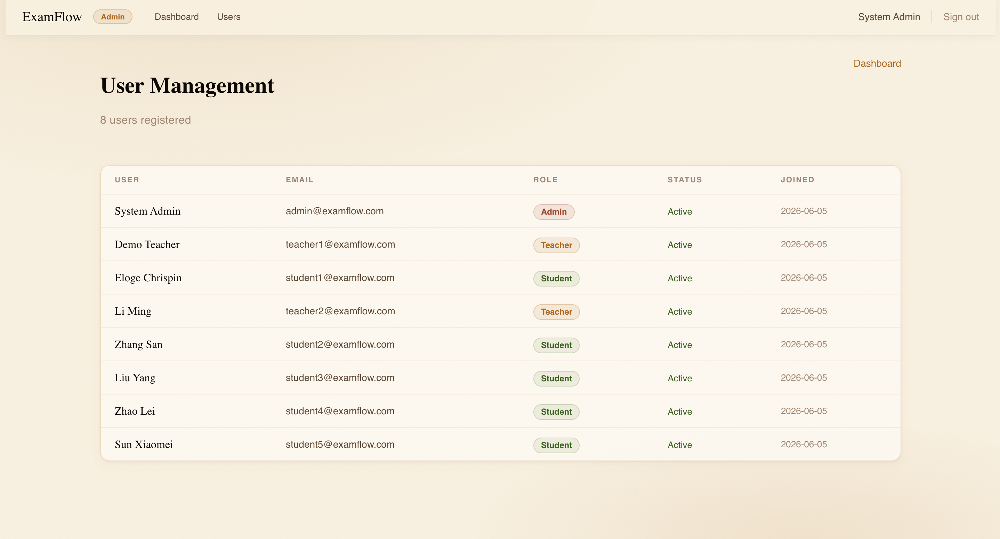

# ExamFlow Pro

> **Online Examination & Intelligent Test Assembly System** — A full-stack web application built with Spring Boot and Next.js

---

## Overview

ExamFlow Pro is a comprehensive online examination platform supporting three user roles — **Administrator**, **Teacher**, and **Student**. It features intelligent test paper assembly, real-time exam sessions with countdown timers, automatic grading, and detailed score analytics. Built as the capstone project for the Java Web Development course at Taizhou University.

---

## Tech Stack

| Layer | Technology |
|---|---|
| Backend API | Spring Boot 3.x, Java 17 |
| Frontend | Next.js 14, React 18, Tailwind CSS |
| Database | MySQL 8.x (11 normalized tables) |
| Authentication | JWT + Spring Security (stateless) |
| ORM | Spring Data JPA / Hibernate |
| Charts | Recharts |
| Build | Maven (backend), npm (frontend) |

---

## User Roles

| Role | Capabilities |
|---|---|
| **Administrator** | Manage all users, view system-wide exams and results |
| **Teacher** | Question bank CRUD, create/assemble/publish papers, view class analytics |
| **Student** | Take timed exams, view personal scores, wrong-answer notebook |

---

## Screenshots

### Teacher Dashboard


### Question Bank Management


### Exam Paper Management


### Student Dashboard


### Student Profile


### Wrong Answer Notebook


### Admin — User Management


---

## Core Features

### Question Bank
- 4 question types: Single Choice, Multiple Choice, True/False, Fill-in-the-Blank
- Nested category tagging with difficulty levels (Easy / Medium / Hard)
- Per-question score weighting and explanations
- Full CRUD with conditional search

### Exam Paper Assembly
- Manual question selection with drag-and-drop ordering
- Rule-based intelligent auto-assembly (by type, difficulty, count)
- Configurable start/end time, duration, total score, and pass threshold
- Paper preview before publishing

### Online Exam Session
- Real-time countdown timer with auto-submit on expiry
- Auto-save answers every 30 seconds (localStorage + API)
- Anti-duplicate submission guard
- Question navigation panel (answered / unanswered)

### Automatic Grading
- Instant scoring for Single Choice, Multiple Choice, True/False
- Fill-in-the-blank: exact match & case-insensitive matching
- Auto-calculated total score and pass/fail determination

### Score Analytics
- **Student:** Personal score history, ranking, wrong-answer notebook
- **Teacher:** Class average, highest/lowest, score distribution charts
- Per-question correct-rate analysis
- Score range breakdown: 0–59, 60–74, 75–89, 90–100

---

## Database (11 Tables)

| Table | Description |
|---|---|
| `users` | All system users (ADMIN, TEACHER, STUDENT) |
| `categories` | Question categories with parent-child nesting |
| `questions` | Question bank with type, difficulty, score |
| `question_options` | MCQ options with correctness flag |
| `question_std_answers` | Fill-in-the-blank standard answers |
| `exam_papers` | Paper metadata (duration, scores, status) |
| `paper_questions` | Ordered questions within a paper |
| `assembly_rules` | Rule-based auto-assembly configuration |
| `exam_sessions` | Student exam attempts with timestamps |
| `student_answers` | Per-question answers per session |
| `score_records` | Final graded score per session |

---

## Project Structure

```
examflow-pro/
├── backend/                         # Spring Boot
│   └── src/main/java/com/examflow/backend/
│       ├── controller/              # REST endpoints
│       ├── service/                 # Business logic
│       ├── repository/              # JPA repositories
│       ├── entity/                  # JPA entities
│       ├── dto/                     # Request/Response objects
│       ├── security/                # JWT filter & config
│       └── exception/               # Global error handling
├── frontend/                        # Next.js
│   ├── app/
│   │   ├── (auth)/login/            # Login page
│   │   ├── admin/                   # Admin dashboard & users
│   │   ├── teacher/                 # Questions, papers, results
│   │   └── student/                 # Dashboard, exam, profile, wrong answers
│   ├── components/                  # Shared UI components
│   ├── hooks/                       # Custom React hooks
│   └── lib/                         # API client & auth utilities
├── sql/                             # schema.sql & test_data.sql
└── screenshots/                     # Application screenshots
```

---

## Quick Start

### 1. Database
```bash
mysql -u root -p < sql/schema.sql
mysql -u root -p examflow < sql/test_data.sql
```

### 2. Backend
```bash
cd backend
# Edit src/main/resources/application.yml with your MySQL credentials
mvn spring-boot:run
# API runs at http://localhost:8080
```

### 3. Frontend
```bash
cd frontend
npm install
npm run dev
# App runs at http://localhost:3000 (or 3001 if 3000 is in use)
```

### Default Demo Accounts

| Role | Email | Password |
|---|---|---|
| Admin | `admin@examflow.com` | `admin123` |
| Teacher | `teacher1@examflow.com` | `teacher123` |
| Student | `student1@examflow.com` | `student123` |

---

## Development Phases

| # | Phase | Key Deliverables |
|---|---|---|
| 1 | Environment & Database | MySQL schema, Spring Boot scaffold |
| 2 | Authentication | JWT login, 3-role access control |
| 3 | Question Bank API | Full CRUD, 4 question types |
| 4 | Question Bank UI | Teacher question management |
| 5 | Exam Paper Management | Manual + rule-based assembly |
| 6 | Online Exam Session | Countdown timer, auto-save, anti-duplicate |
| 7 | Auto-Grading Engine | Grading logic, score records |
| 8 | Score Analytics | Charts, statistics, class overview |
| 9 | Wrong Answer Notebook | Student review with explanations |
| 10 | Testing & Polish | Test cases, SQL scripts, demo |

---

## Author

| Field | Value |
|---|---|
| Project | ExamFlow Pro — Online Exam & Intelligent Test Assembly System |
| Course | Java Web Development Capstone |
| Author | Prince Niyibizi |
| University | Taizhou University |
| GitHub | [github.com/niyibizimadeit](https://github.com/niyibizimadeit) |
